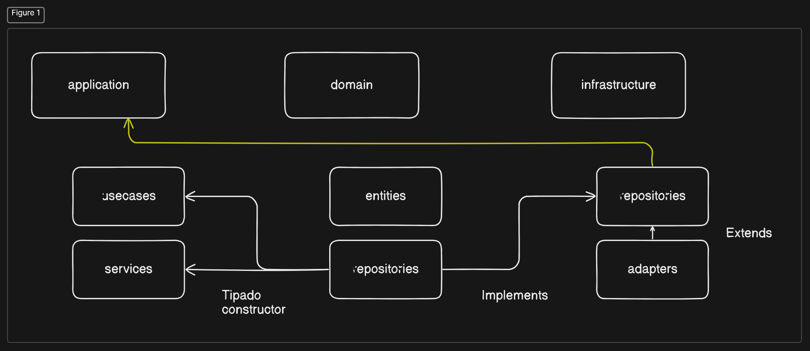

# Hexa rulez

# Hexagonal rules
_Updated 28.08 - branch `thirdweb-usecases`_

## Introducción
Este repositorio tiene como objetivo definir las mejores prácticas posibles para una aplicación hexagonal realizada con NextJs

Aqui intentare definir:

- Estructura carpetas definida
- Reglas y objetivos apartados definidos
- Dudas surgidas durante el proceso y,
- Formas de abordar las dudas
- Información sobre arquitectura hexagonal
    - Importancia de la separación
    - Uso de apartados


## Dudas/reglas
- Implementación de adapters. En los casos en los que el adapter ha de proveer funciones que serán utilizadas por la aplicación, debería crear un repositorio para este adapter.
- _Buena práctica: * _Que los services usen use-cases?!??. Creo que es completamente innecesario y no veo el sentido aparte de atomizar mas.
- 
### Implementacion adapter
En el caso de que se deban utilizar funciones de el adapter, en la aplicacion, y no solo dentro de los repos, creo que lo mas correcto sera: Añadir estas funciones en toda la aplicacion, desde domain para arriba. La duda que surgue es:

- Deberia crear un repositorio separado o incluirlo dentro del mismo repositorio. Lo mas correcto creo que es separarlo en dos repositorio separados, si hay funciones que no tienen que ver unas con las otras, como normalmente esto no sucedera, lo mas correcto es uno.
- Por lo tanto: **De momento no crearemos repositorios para los adapters**
### Services usan use-cases
En el caso de que se tengan que crear acciones que utilizan varios repositorios, crearemos directamente un services, el cual gestionara dicha acción.

- En el caso de que una parte de accion se reutilize o se utilize solo un repositorio, entonces sera use-cases
- Se podria hacer que los services usen use-cases pero creo que es innecesario en caso de que no se cumpla la regla anterior
- Por lo tanto: **De momento no obligaremos a los services a usar use-cases**
#### Chat gpt
**Pregunta**

Sobre estructuración arq hexagonal o clean arq, acerca de los services: Cuando tengo acciones que requieren de varios repositorios, por ejemplo para tablas relaciones bdd, creo las acciones en un apartado application/services. En el cual, en vez de usar use-cases como norma, utilizo directamente los repositorios. Mi pregunta es, es obligatorio utilizar los use-cases dentro de los repositorio? Ya que sino los use-cases quedan limitados practicamente a solo las acciones que requieren de un solo repositorio, como los Read a la bdd


Ejemplo practico:


```tsx

export class DeleteUserAccount extends UseUserRoleAuthService{

 async execute(payload: { signature: `0x${string}`; payload: LoginPayload; },id:string, address: string){ const v = await this.authRepository.verifyPayload(payload) if(!v.valid) throw new Error("Error with payload auth") if(v.payload.address!==address) throw new Error("User only can delete her address")

 //deleteUser(id) const user = await this.userRepository.findById(id) if (!user) throw new Error("User not found") if (user.roleId !== null) { await this.roleRepository.delete(user.roleId) } await this.userRepository.delete(id) await this.authRepository.logout() }

}

```

**Respuesta**

En primer lugar, es importante aclarar que no es estrictamente obligatorio utilizar casos de uso dentro de los servicios o directamente con los repositorios. La arquitectura hexagonal (o Clean Architecture) es flexible y puede adaptarse a las necesidades específicas de cada proyecto. Sin embargo, hay algunas consideraciones importantes:

1. Separación de responsabilidades:
Los casos de uso (use cases) generalmente representan las reglas de negocio y las operaciones de la aplicación. Los servicios, por otro lado, pueden ser una capa intermedia que coordina múltiples casos de uso o repositorios.
2. Reutilización y composición:
Los casos de uso pueden ser más granulares y reutilizables. Esto permite componer operaciones más complejas a partir de casos de uso más simples.
3. Testabilidad:
Los casos de uso suelen ser más fáciles de probar de forma aislada, ya que encapsulan una lógica de negocio específica.
En tu ejemplo `DeleteUserAccount`, estás utilizando múltiples repositorios directamente en el servicio. Este enfoque puede ser válido, especialmente si la operación es compleja y requiere coordinar varias acciones que involucran diferentes entidades.

Sin embargo, podrías considerar refactorizar esto en casos de uso más pequeños:

```typescript
class DeleteUserAccount extends UseUserRoleAuthService {
  constructor(
    private authUseCase: AuthUseCase,
    private deleteUserUseCase: DeleteUserUseCase,
    private deleteRoleUseCase: DeleteRoleUseCase
  ) {
    super();
  }

  async execute(payload: {
    signature: `0x${string}`;
    payload: LoginPayload;
  }, id: string, address: string) {
    await this.authUseCase.verifyPayload(payload, address);
    await this.deleteUserUseCase.execute(id);
    await this.authUseCase.logout();
  }
}

class DeleteUserUseCase {
  constructor(
    private userRepository: UserRepository,
    private roleRepository: RoleRepository
  ) {}

  async execute(id: string) {
    const user = await this.userRepository.findById(id);
    if (!user) throw new Error("User not found");
    if (user.roleId !== null) {
      await this.roleRepository.delete(user.roleId);
    }
    await this.userRepository.delete(id);
  }
}
```
Este enfoque tiene varias ventajas:

1. Cada caso de uso es más específico y reutilizable.
2. La lógica de negocio está más encapsulada y es más fácil de probar.
3. El servicio `DeleteUserAccount`  se convierte en un orquestador de casos de uso más pequeños.
En conclusión, no es obligatorio usar casos de uso para cada operación con repositorios, pero pueden ofrecer beneficios en términos de organización, reutilización y testabilidad del código. Tu enfoque actual no es incorrecto, pero podrías considerar refactorizar hacia casos de uso más granulares si sientes que esto podría mejorar la estructura y mantenibilidad de tu código.


## Versiones
### Thirdweb
- A partir de thirdweb version, solo se mantienen los use-cases que se utilizan, el resto se comentan y se guardaran en una branch llamada `thirdweb-usecases`


***


## Estructura carpetas definidas


## Reglas y objetivos apartados definidos
### Application
- Funciones que serán utilizadas directamente por la aplicación. 
- Separado en archivos según su domain/repo y infra/repo


##### Use-cases
- Funciones con uso de un solo repositorio
- Siempre se deberían usar en actions, nunca en complementos ni páginas
##### Services
- Funciones con uso de varios repositorios
- Siempre se deberían usar en actions, nunca en complementos ni páginas


#### Domain
- Lo que la define la aplicación.


##### Entities
- Las entidades de la aplicación
- Typos base de dichas entidades


##### Repositories
- Tipado de las funciones ppales de la aplicación


#### Infrastructure
- El almacenamiento de la aplicación


##### Repositories
- Persistencia de la aplicación


##### Adapters
- Adaptadores necesarios para la persistencia


#### Análisis de tu esbozo
1. **Application**:
    - **Acierto**: Separar funciones según `domain/repo`  y `infra/repo`  es una buena práctica, ya que facilita la organización y el mantenimiento del código.
    - **Sugerencia**: Asegúrate de que las funciones en esta capa sean puras y no tengan efectos secundarios, lo que ayudará a mantener la integridad de tu aplicación.
2. **Use-cases**:
    - **Acierto**: Definir funciones que interactúan con un solo repositorio es coherente con la idea de que cada caso de uso debe ser responsable de una única tarea.
    - **Sugerencia**: Considera incluir validaciones y lógica de negocio dentro de esta capa para evitar que la lógica se disperse.
3. **Services**:
    - **Acierto**: Agrupar funciones que usan varios repositorios es útil, especialmente para operaciones más complejas.
    - **Sugerencia**: Asegúrate de que los servicios no se conviertan en "dioses" que manejan demasiada lógica. Mantén la responsabilidad bien definida.
4. **Domain**:
    - **Acierto**: Definir claramente lo que representa tu dominio es fundamental. Esto establece las bases para el resto de tu aplicación.
    - **Sugerencia**: Considera utilizar un lenguaje ubicuo en esta capa para facilitar la comunicación entre desarrolladores y otros interesados.
5. **Entities**:
    - **Acierto**: Tener entidades bien definidas es clave para la estructura de tu aplicación.
    - **Sugerencia**: Asegúrate de que las entidades sean inmutables cuando sea posible, lo que puede simplificar el manejo del estado.
6. **Repositories**:
    - **Acierto**: La separación del tipado de funciones principales es buena para la claridad y el mantenimiento.
    - **Sugerencia**: Considera definir interfaces claras para tus repositorios, lo que facilitará la implementación de pruebas y cambios futuros.
7. **Infrastructure**:
    - **Acierto**: Tener una capa de infraestructura bien definida es esencial para desacoplar la lógica de negocio del almacenamiento.
    - **Sugerencia**: Asegúrate de que la infraestructura pueda ser fácilmente reemplazada o modificada sin afectar el resto de la aplicación.
8. **Adapters**:
    - **Acierto**: La inclusión de adaptadores es importante para la flexibilidad y la integración con diferentes tecnologías.
    - **Sugerencia**: Mantén tus adaptadores delgados y enfocados en la conversión de datos, dejando la lógica de negocio en las capas superiores.
#### Normas sugeridas para Clean Architecture/Arquitectura Hexagonal
1. **Separación de preocupaciones**: Mantén cada capa de tu aplicación enfocada en una responsabilidad específica. Esto facilita el mantenimiento y la escalabilidad.
2. **Inversión de dependencias**: Las capas superiores no deben depender de las capas inferiores. Utiliza interfaces para que las capas superiores puedan interactuar con las inferiores sin acoplarse a implementaciones específicas.
3. **Pruebas unitarias**: Diseña tu código para que sea fácilmente testeable. Esto incluye el uso de inyección de dependencias y la separación de la lógica de negocio de las interacciones con el sistema.
4. **Lenguaje ubicuo**: Utiliza un lenguaje común que todos los miembros del equipo entiendan, especialmente en la capa de dominio. Esto ayuda a evitar malentendidos y promueve una comunicación clara.
5. **Documentación**: Mantén una buena documentación de tu arquitectura y decisiones de diseño. Esto facilitará la incorporación de nuevos desarrolladores y el mantenimiento a largo plazo.
6. **Adaptabilidad**: Diseña tu aplicación de manera que sea fácil de modificar y extender. Esto incluye el uso de patrones de diseño y la implementación de principios SOLID.
7. **SSR y Next.js**: Aprovecha las capacidades de SSR de Next.js para cargar datos en el servidor y enviarlos al cliente, minimizando la carga en el navegador y mejorando el rendimiento.
### Jerarquia
1. **Domain**
    - **Entities**
    - **Repos**
2. **Application**
    - **Use-cases**
    - **Services**
3. **Infrastructure**
    - **Adapters**
    - **Repos**
#### Justificación del orden:
1. **Domain**: Esta es la capa más importante, ya que contiene la lógica de negocio y las entidades que representan el núcleo de tu aplicación. Las decisiones en esta capa deben ser independientes de cualquier tecnología o implementación.
2. **Application**: La capa de aplicación se encarga de coordinar la lógica de negocio a través de casos de uso y servicios. Aquí es donde se definen las interacciones entre el dominio y la infraestructura.
3. **Infrastructure**: Esta capa es la más externa y se ocupa de la implementación técnica, como bases de datos, APIs externas, etc. Debe ser lo más independiente posible de las capas superiores.
#### Graphic structure



